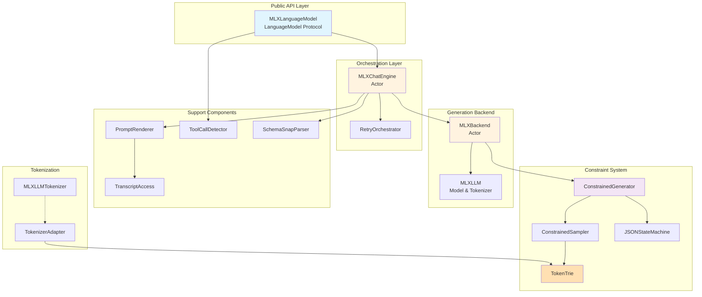
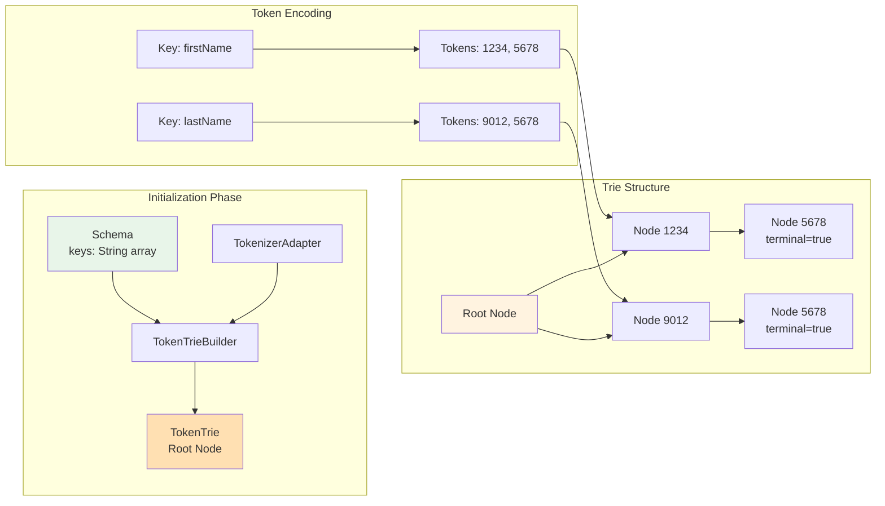
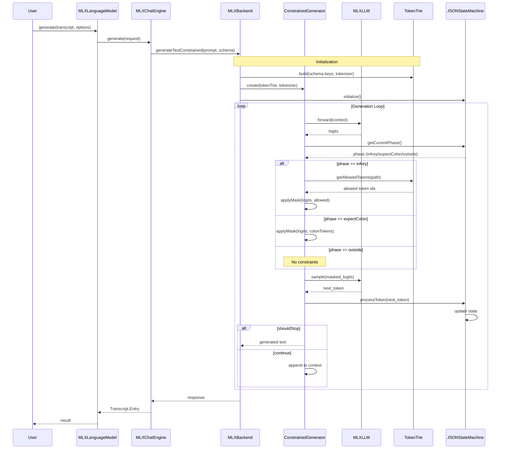
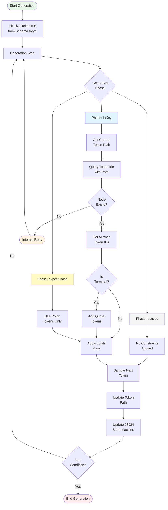

# CLAUDE.md

This file provides guidance to Claude Code (claude.ai/code) when working with code in this repository.

## Project Overview

This repository implements an MLX-backed adapter for OpenFoundationModels (OFM) that provides local inference capabilities while maintaining 100% API compatibility with Apple's LanguageModel protocol. The core innovation is **TokenTrie-based Schema-Constrained Decoding (SCD)** that ensures JSON generation strictly adheres to defined schemas at the token level.

**Requirements**: Swift 6.2+ (Xcode 16.x or later)

## Build and Development Commands

```bash
# Build
swift build                    # Debug build
swift build -c release         # Release build

# Test
swift test --parallel          # Run tests in parallel
swift test --enable-code-coverage  # Run with coverage

# Package management
swift package resolve          # Resolve dependencies
swift package update           # Update dependencies

# Open in Xcode (optional)
xed .

# Format code (if swift-format is installed)
swift-format format -i -r Sources Tests
```

## System Architecture



## TokenTrie System Design



## Generation Flow with TokenTrie Constraints



## TokenTrie Detailed Flow



## JSON State Machine Transitions

```mermaid
stateDiagram-v2
    [*] --> Outside: Initial
    
    Outside --> InKey: {/" or ,/"
    
    InKey --> InKey: token_id in allowed
    InKey --> ExpectColon: terminal & "
    
    ExpectColon --> Outside: :
    
    Outside --> [*]: Complete
    
    note right of InKey
        Track token path
        Query TokenTrie
        Apply constraints
    end note
    
    note right of ExpectColon
        Only colon tokens allowed
    end note
    
    note left of Outside
        No constraints
        Free generation
    end note
```

## Core Components

### External API Contract (Immutable)
The adapter strictly adheres to OFM's `LanguageModel` protocol:
- `generate(transcript:options:) async throws -> Transcript.Entry`
- `stream(transcript:options:) -> AsyncStream<Transcript.Entry>`
- `isAvailable: Bool`, `supports(locale:) -> Bool`

No breaking changes are allowed. All enhancements are internal-only.

### TokenTrie System (Core Innovation)

**Purpose**: Enforce JSON schema constraints at the token level during generation.

**Components**:
- `TokenTrie.swift`: Trie data structure for token sequences with Path management
- `MLXLLMTokenizer.swift`: Concrete TokenizerAdapter implementation
- `EnhancedJSONStateMachine.swift`: Token-aware JSON state tracking
- `ConstrainedSampler.swift`: Applies token constraints via logits masking
- `ConstrainedGenerator.swift`: Orchestrates constrained generation

**Key Features**:
- Token-level constraint enforcement (not character-level)
- Path tracking for stateful generation
- Terminal detection for key completion
- Efficient caching of compiled tries

### Internal Architecture

**Engine Layer** (`Internal/Engine/`)
- `MLXChatEngine.swift`: Generation orchestration with retry logic
- `MLXBackend.swift`: MLXLLM integration point (currently stubbed)
- `RetryOrchestrator.swift`: Minimal-side-effect retry management

**Prompt Processing** (`Internal/Prompt/`)
- `PromptRenderer.swift`: Builds ChatRequest from Transcript
- `TranscriptAccess.swift`: Strong-typed Transcript extraction
- `OptionsMapper.swift`: Maps generation options

**Schema Validation** (`Internal/Decode/`)
- `SchemaConstrainedDecoder.swift`: Orchestrates SCD
- `SchemaSnapParser.swift`: Post-generation key correction via Snap algorithm (distance-1 edit)
- `JSONUtils.swift`: JSON parsing utilities

**Tool Support** (`Internal/Tooling/`)
- `ToolCallDetector.swift`: Detects `{"tool_calls":[...]}` patterns

**Tokenization** (`Internal/Tokenization/`)
- `MLXLLMTokenizer.swift`: TokenizerAdapter implementation
- Special token discovery for JSON symbols (quotes, colons, braces)

## Key Implementation Details

### Schema-Constrained Decoding (SCD) Flow

SCD (Schema-Constrained Decoding) enforces JSON schema compliance at the token level during generation.

1. **Initialization**:
   - Convert schema keys to token sequences
   - Build TokenTrie from token sequences
   - Identify special tokens (quotes, colons)

2. **Generation Loop**:
   - Get logits from model
   - Determine current JSON phase (inKey, expectColon, outside)
   - If inKey: Query TokenTrie for allowed tokens
   - Apply logits mask to enforce constraints
   - Sample from constrained distribution

3. **State Management**:
   - Track token path during key emission
   - Reset path when exiting key state
   - Maintain JSON parsing state

### Retry Policy (Primitive)
- Settings and prompt unchanged across attempts
- No retry when seed specified (deterministic)
- Max attempts: 2 (configurable via `OFM_MLX_RETRY_MAX`)
- noKeyCandidate triggers immediate retry

### Error Handling
- `noKeyCandidate`: No valid token continuations -> internal retry
- Schema violations: Detected post-generation -> retry if within limit
- Stream mode: Only successful attempts emit output

## TokenTrie Technical Details

### Data Structure
```swift
struct TokenTrie {
    class Node {
        var children: [Int32: Node]  // Token ID to child node
        var terminal: Bool           // Can complete key here
        var keyName: String?         // Original key for debugging
    }
    
    struct Path {
        var tokens: [Int32]          // Current token sequence
        var currentNode: Node?       // Current position in trie
    }
}
```

### Constraint Application
```swift
// Phase: inKey
allowedTokens = trie.getAllowedTokens(path)
if path.isAtTerminal() {
    allowedTokens.union(quoteTokens)  // Can close key
}

// Apply mask
for i in 0..<logits.count {
    if !allowedTokens.contains(i) {
        logits[i] = -infinity
    }
}
```

### Performance Optimizations
- Trie caching by schema fingerprint
- Efficient logits masking (O(allowed) not O(vocab))
- Path tracking avoids repeated traversal

## Environment Variables

- `OFM_MLX_RETRY_MAX`: Maximum internal retry attempts (default: 2)
- `OFM_MLX_SCHEMA_JSON`: Override schema JSON (temporary workaround)
- `OFM_MLX_ENABLE_SCD`: Enable/disable SCD (default: true)

## Testing Strategy

### Unit Tests
- TokenTrie path tracking and traversal
- JSONStateMachine state transitions
- Constraint computation correctness
- Special token discovery

### Integration Tests
- End-to-end schema-compliant generation
- Retry mechanism validation
- Streaming with constraints
- Tool call detection with SCD

### Test Files
- `Tests/OpenFoundationModels-MLXTests/`
  - `LanguageModelSmokeTests.swift`: Basic API tests
  - `ChatClientSmokeTests.swift`: Chat interface tests
  - `ToolCallDetectorTests.swift`: Tool detection tests

## Code Style

- Swift 6.2, 4-space indentation, <= 120 column soft limit
- Types/Enums/Protocols: `PascalCase`
- Methods/Variables: `lowerCamelCase`
- Public APIs require `///` documentation
- Run `swift-format` if available

## Current Status and Limitations

### Working
- ✅ Compilation fixed (Actor boundaries, async/await)
- ✅ TokenTrie with Path management
- ✅ Enhanced JSON state machine
- ✅ ConstrainedSampler with logits masking
- ✅ MLXLLMTokenizer stub implementation

### Pending MLXLLM Integration
- Actual tokenizer wrapping
- Model forward pass for logits
- Step-by-step generation loop
- Temperature/top-k/top-p sampling

### Known Issues
- MLXBackend is stubbed pending MLXLLM API
- Schema extraction from OFM Extra limited
- Special token discovery needs real tokenizer

## Future Enhancements

1. **MLXLLM Integration**:
   - Connect real tokenizer
   - Implement forward pass
   - Enable step/logits hooks

2. **Optimization**:
   - Batch constraint computation
   - Parallel trie construction
   - Memory-mapped trie cache

3. **Features**:
   - Multiple schema support
   - Nested object constraints
   - Array element validation

## Migration Guide

### MLXLLM Integration Update (Current Version)

This section documents the migration from standalone TokenTrie implementation to full MLXLLM integration with GPU-optimized constrained decoding.

#### Key Changes

##### 1. Package Dependencies
Updated Package.swift with official MLXLLM dependencies:
```swift
dependencies: [
    .package(url: "https://github.com/ml-explore/mlx-swift-examples.git", branch: "main"),
    .package(url: "https://github.com/huggingface/swift-transformers", .upToNextMinor(from: "0.1.23")),
]
```

##### 2. New TokenTrieLogitProcessor
Implemented LogitProcessor protocol for MLXLLM integration:
```swift
public struct TokenTrieLogitProcessor: LogitProcessor {
    public func process(logits: MLXArray) -> MLXArray {
        // GPU-optimized logits masking using MLX operations
        let negInf = MLX.full(logits.shape, values: -Float.infinity)
        return MLX.where(reshapedMask .> 0, logits, negInf)
    }
}
```

##### 3. MLXLLMTokenizer Rewrite
Complete rewrite using swift-transformers:
```swift
public final class MLXLLMTokenizer: TokenizerAdapter, @unchecked Sendable {
    private let tokenizer: any Tokenizer
    
    public func findSpecialTokens() -> SpecialTokens {
        // Enhanced validation with exact-match filtering
        for symbol in jsonSymbols {
            let tokenIds = tokenizer.encode(text: symbol, addSpecialTokens: false)
            for tokenId in tokenIds {
                let decoded = tokenizer.decode(tokens: [tokenId])
                if decoded == symbol { /* add to special tokens */ }
            }
        }
    }
}
```

##### 4. Enhanced SCD Components

**Comprehensive Test Suite**:
- JSONKeyTracker state machine tests
- KeyTrie prefix matching validation  
- SchemaSnapParser correction algorithm tests
- RetryOrchestrator error handling tests
- Integration tests for TokenTrie constraint computation

**Tool Call Detection Improvements**:
- Priority detection for `{"tool_calls": ...}` patterns
- Enhanced JSON extraction with safety checks
- Support for both "arguments" and "parameters" keys
- Robust error handling with partial parsing

**TranscriptAccess JSON Serialization**:
- Schema extraction via encoding/decoding workaround
- Tool parameter JSON extraction using temporary transcripts
- Full compatibility with OpenFoundationModelsExtra package visibility

#### Migration Steps

##### For Existing Users

1. **Update Dependencies**
   ```bash
   swift package update
   swift build
   ```

2. **API Changes**
   - `MLXLLMTokenizer` now requires swift-transformers `Tokenizer`
   - `TokenTrieLogitProcessor` replaces direct logits manipulation
   - Enhanced error handling in all SCD components

3. **Testing Migration**
   ```swift
   // Old approach
   let detector = ToolCallDetector()
   
   // New approach with enhanced detection
   let entry = ToolCallDetector.entryIfPresent(jsonText)
   ```

##### For New Implementations

1. **TokenTrie Integration**
   ```swift
   let tokenTrie = TokenTrie()
   tokenTrie.insert(tokenIDs: [1, 2, 3], keyName: "name")
   
   let processor = TokenTrieLogitProcessor(
       tokenTrie: tokenTrie,
       specialTokens: tokenizer.getSpecialTokens(),
       keyTrie: KeyTrie(keys: schema.keys)
   )
   ```

2. **Constrained Generation**
   ```swift
   let result = try await backend.generateTextConstrained(
       prompt: prompt,
       sampling: sampling,
       schema: schema
   )
   ```

#### Performance Improvements

- **GPU Acceleration**: All constraint evaluation moved to GPU via MLXArray operations
- **Special Token Caching**: Token discovery results cached per model
- **Optimized JSON Parsing**: Priority detection reduces parsing overhead
- **Enhanced Error Recovery**: RetryOrchestrator with exponential backoff

#### Breaking Changes

1. **TokenizerAdapter Interface**
   - `getVocabSize()` now returns optional Int
   - Enhanced special token discovery with validation

2. **SCD Error Types**
   - New ConstraintError cases for improved error handling
   - Detailed error contexts for debugging

3. **MLXBackend Placeholder**
   - Temporarily simplified due to ModelContainer API instability
   - Full implementation pending API stabilization

#### Compatibility Notes

- **Swift 6.2+ Required**: Enhanced concurrency features
- **OpenFoundationModels Compatibility**: Full API compliance maintained
- **MLXLLM API Stability**: Core implementation ready, backend pending stable API

## Dependencies

- `OpenFoundationModels`: Core protocol definitions
- `OpenFoundationModelsExtra`: Transcript utilities
- `MLXLLM`: MLX Swift interface with LogitProcessor integration
- `MLXLMCommon`: MLX model container support
- `swift-transformers`: Tokenizer implementation

## Key Files Reference

### Core Implementation
- `Adapter/MLXLanguageModel.swift`: Public API adapter
- `Internal/Engine/MLXChatEngine.swift`: Generation orchestrator
- `Internal/Decode/TokenTrie.swift`: Token constraint trie
- `Internal/Decode/ConstrainedGenerator.swift`: SCD generator
- `Internal/Tokenization/MLXLLMTokenizer.swift`: Tokenizer wrapper

### State Management
- `Internal/Decode/EnhancedJSONStateMachine.swift`: JSON parsing state
- `Internal/Decode/ConstrainedSampler.swift`: Constraint application

### Support
- `Internal/Prompt/PromptRenderer.swift`: Request building
- `Internal/Tooling/ToolCallDetector.swift`: Tool call extraction
- `Internal/Decode/SchemaSnapParser.swift`: Key correction