# CLAUDE.md

This file provides guidance to Claude Code (claude.ai/code) when working with code in this repository.

## Project Overview

OpenFoundationModels-MLX is a production-ready MLX adapter for OpenFoundationModels that implements **ADAPT (Adaptive Dynamic Assertion Protocol for Transformers)** - an advanced evolution beyond traditional Schema-Constrained Decoding. ADAPT provides GPU-accelerated local inference on Apple Silicon with guaranteed JSON schema compliance through adaptive token-level assertion.

**Requirements**: Swift 6.2+ (Xcode 16.x or later), macOS 15.0+ (Sequoia), Apple Silicon Mac (M1/M2/M3)

## ADAPT: Adaptive Dynamic Assertion Protocol for Transformers

### System Definition

ADAPT is a token-level constraint system that guarantees JSON generation conforms to specified schemas through four integrated subsystems:

1. **TokenTrie Engine (TTE)** - Efficient token constraint management
2. **Phase-Aware Navigator (PAN)** - JSON state tracking and constraint selection
3. **Constraint Optimizer (CO)** - GPU-optimized logit manipulation
4. **Recovery Manager (RM)** - Error detection and correction

### Architectural Requirements

```mermaid
graph TB
    subgraph "Input Layer"
        Schema[JSON Schema<br/>Array of Keys]
        Tokenizer[HuggingFace Tokenizer<br/>swift-transformers]
        Logits[Model Logits<br/>MLXArray]
    end
    
    subgraph "ADAPT Core"
        TLP[TokenTrieLogitProcessor<br/>LogitProcessor Protocol]
        
        subgraph "TTE Subsystem"
            TT[TokenTrie<br/>Prefix Tree Structure]
            TTB[TokenTrieBuilder<br/>with Cache]
            Path[Path Tracker<br/>State Management]
        end
        
        subgraph "PAN Subsystem"
            JSM[JSONStateMachine<br/>Phase Tracking]
            JKT[JSONKeyTracker<br/>Violation Detection]
            JMH[JSONMaskHintGenerator<br/>Constraint Selection]
        end
        
        subgraph "CO Subsystem"
            HM[Hard Masking<br/>-∞ for Invalid]
            SB[Soft Biasing<br/>+2.5 for Preferred]
            MLXOps[MLX GPU Operations]
        end
        
        subgraph "RM Subsystem"
            AG[AbortableGenerator<br/>Early Termination]
            SSP[SchemaSnapParser<br/>Distance-1 Correction]
            EOS[EOS Boosting<br/>Safe Termination]
        end
    end
    
    subgraph "Output Layer"
        MaskedLogits[Constrained Logits<br/>MLXArray]
        JSON[Valid JSON<br/>Schema Compliant]
    end
    
    Schema --> TTB
    Tokenizer --> TTB
    TTB --> TT
    TT --> Path
    
    Logits --> TLP
    TLP --> JSM
    TLP --> JKT
    TLP --> JMH
    
    JSM --> JMH
    JKT --> JMH
    JMH --> HM
    JMH --> SB
    
    Path --> HM
    HM --> MLXOps
    SB --> MLXOps
    MLXOps --> MaskedLogits
    
    TLP --> AG
    AG --> EOS
    AG --> SSP
    SSP --> JSON
    
    style TLP fill:#f3e5f5
    style TT fill:#ffe0b2
    style JSM fill:#e1f5fe
    style MLXOps fill:#e8f5e9
```



## ADAPT Implementation Specification

### 1. TokenTrie Engine (TTE) Specification

#### Data Structure Requirements
```swift
public struct TokenTrie: Sendable {
    // Node must support concurrent read access
    final class Node: Sendable {
        let children: Mutex<[Int32: Node]>  // Child nodes by token ID
        let terminal: Bool                   // Indicates key completion point
        let keyName: String?                 // Original key for debugging
    }
    
    // Path maintains generation state
    public struct Path: Sendable {
        private(set) var tokens: [Int32] = []     // Token sequence
        private(set) var currentNode: Node? = nil // Current trie position
        
        // Required operations
        mutating func append(_ tokenID: Int32, in trie: TokenTrie) -> Bool
        mutating func reset(to root: Node? = nil)
        func isAtTerminal() -> Bool
        func getKeyName() -> String?
    }
    
    // Root node and key tracking
    public let root: Node
    public let allKeys: Set<String>
    
    // Required operations
    public func getAllowedTokens(for path: Path) -> Set<Int32>
    public func canComplete(from path: Path) -> Bool
}
```

#### Builder Requirements
```swift
public enum TokenTrieBuilder {
    // Cache key format: "{tokenizer_fingerprint}|{sorted_keys_joined}"
    static func buildCached(schema: SchemaMeta, tokenizer: TokenizerAdapter) -> TokenTrie
    
    // Build process:
    // 1. Extract unique non-empty keys from schema
    // 2. Encode each key using tokenizer
    // 3. Insert token sequences into trie
    // 4. Mark terminal nodes with key names
    // 5. Cache result with tokenizer fingerprint
}
```

### 2. Phase-Aware Navigator (PAN) Specification

#### State Machine Requirements
```swift
public final class JSONStateMachine: Sendable {
    public enum Phase: Sendable, Equatable {
        case root
        case inObject(ObjectPhase)
        case inArray(ArrayPhase)
        case inString(StringPhase)
        case inNumber(NumberPhase)
        case inLiteral(LiteralPhase)
        case done
        case error
    }
    
    // Thread-safe state management
    private let state = Mutex(State())
    
    // Required state transitions
    public func processCharacter(_ char: Character)
    public func reset()
    public func isComplete() -> Bool
    public func isError() -> Bool
}
```

#### Constraint Selection Logic
```swift
public struct JSONMaskHintGenerator {
    enum ConstraintMode {
        case hard   // Physical masking with -∞
        case soft   // Logit biasing with +2.5
    }
    
    // Phase-based constraint selection
    func generateHint(for phase: JSONStateMachine.Phase) -> MaskHint? {
        switch phase {
        case .inObject(.expectKeyFirstQuote):
            return .hard(quoteTokens)  // MUST be quote
        case .inString(.body(kind: .key, _)):
            return .hard(trieTokens)    // MUST follow trie
        case .inObject(.expectColon):
            return .hard(colonTokens)   // MUST be colon
        case .inObject(.expectValueStart):
            return .soft(valueTokens)   // PREFER value starts
        default:
            return nil                   // NO constraints
        }
    }
}
```

### 3. Constraint Optimizer (CO) Specification

#### GPU Operations Requirements
```swift
// Hard mask application - guarantees compliance
private func applyHardMaskOptimized(to logits: MLXArray, allowedTokens: Set<Int32>) throws -> MLXArray {
    let vocabSize = logits.dim(logits.ndim - 1)
    
    // Create binary mask on GPU
    var mask = MLX.zeros([vocabSize], dtype: .float32)
    for tokenId in allowedTokens {
        mask[tokenId] = 1.0
    }
    
    // Apply mask with -infinity for invalid tokens
    let negInf = MLX.full(logits.shape, values: -Float.infinity)
    let reshapedMask = mask.reshaped([1, vocabSize])
    
    // GPU-parallel where operation
    return MLX.where(reshapedMask .> 0, logits, negInf)
}

// Soft bias application - influences preference
private func applySoftBias(to logits: MLXArray, preferredTokens: Set<Int32>, bias: Float = 2.5) -> MLXArray {
    var biasArray = MLX.zeros(logits.shape, dtype: .float32)
    for tokenId in preferredTokens {
        biasArray[..., tokenId] = bias
    }
    return logits + biasArray
}
```

### 4. Recovery Manager (RM) Specification

#### Error Detection and Recovery
```swift
public final class AbortableGenerator {
    private let processor: TokenTrieLogitProcessor
    
    // Wrap generation stream with error monitoring
    func generate(baseStream: AsyncThrowingStream<GenerationChunk, Error>) -> AsyncThrowingStream<GenerationChunk, Error> {
        AsyncThrowingStream { continuation in
            Task {
                for try await chunk in baseStream {
                    // Check for constraint violations
                    if let error = processor.getLastError() {
                        // Attempt recovery before aborting
                        if !attemptRecovery(error) {
                            continuation.finish(throwing: error)
                            return
                        }
                    }
                    continuation.yield(chunk)
                }
            }
        }
    }
    
    private func attemptRecovery(_ error: JSONGenerationError) -> Bool {
        // Recovery strategies:
        // 1. Boost EOS token probability
        // 2. Reset to last valid state
        // 3. Apply Snap correction for near-misses
    }
}
```

## ADAPT Integration Flow

### Token Processing Pipeline


### State Management Architecture

```swift
// Three-tier state for optimal concurrency
public final class TokenTrieLogitProcessor: LogitProcessor {
    // Tier 1: Fast reads (most frequent access)
    private let lightweightState: Mutex<ProcessorSnapshot>
    struct ProcessorSnapshot {
        let jsonPhase: JSONStateMachine.Phase
        let tokenPath: TokenTrie.Path
        let isGenerating: Bool
        let tokenCount: Int
    }
    
    // Tier 2: Complex updates (less frequent)
    private let heavyState: Mutex<HeavyState>
    struct HeavyState {
        var jsonStateMachine: JSONStateMachine
        var keyTracker: JSONKeyTracker
        var generatedTokens: [Int32]
    }
    
    // Tier 3: Error tracking (atomic operations)
    private let errorState: Mutex<JSONGenerationError?>
}
```

## Build and Development Commands

```bash
# Build
swift build                    # Debug build
swift build -c release         # Release build

# Test ADAPT components
swift test --filter TokenTrieTests  # Test TTE
swift test --filter JSONStateMachineTests  # Test PAN
swift test --filter TokenTrieLogitProcessorTests  # Test CO
swift test --filter AbortableGeneratorTests  # Test RM

# Integration tests
swift test --filter ConstrainedGenerationIntegrationTests  # Full ADAPT validation

# Package management
swift package resolve          # Resolve dependencies
swift package update           # Update dependencies

# Open in Xcode
xed .
```

## Key Implementation Files

### ADAPT Core Implementation
- `Internal/Processor/TokenTrieLogitProcessor.swift`: Main ADAPT processor implementing LogitProcessor protocol
- `Internal/Core/CoreTypes.swift`: TokenTrie data structure and Path implementation
- `Internal/Decode/JSONStateMachine.swift`: JSON phase tracking state machine
- `Internal/Generation/AbortableGenerator.swift`: Stream wrapper for error recovery

### Supporting Components
- `Internal/Decode/JSONMaskHintGenerator.swift`: Phase-based constraint selection
- `Internal/Decode/JSONKeyTracker.swift`: Schema violation tracking
- `Internal/Decode/SchemaSnapParser.swift`: Distance-1 key correction
- `Internal/Utils/MLXUtils.swift`: GPU operation utilities

### Integration Points
- `Internal/Engine/MLXBackend.swift`: ModelContainer integration with ADAPT
- `Internal/Engine/MLXChatEngine.swift`: High-level orchestration
- `Internal/Tokenization/MLXLLMTokenizer.swift`: TokenizerAdapter implementation

## Testing Requirements

### Unit Test Coverage
Each ADAPT subsystem must have comprehensive tests:

1. **TTE Tests** (`TokenTrieTests.swift`)
   - Trie construction from schema
   - Path tracking and updates
   - Terminal detection
   - Cache key generation

2. **PAN Tests** (`JSONStateMachineTests.swift`)
   - All phase transitions
   - Nested structure handling
   - Error state detection
   - Character-by-character processing

3. **CO Tests** (`TokenTrieLogitProcessorTests.swift`)
   - Hard mask application
   - Soft bias application
   - Dynamic token discovery
   - GPU operation correctness

4. **RM Tests** (`AbortableGeneratorTests.swift`)
   - Error detection
   - Recovery strategies
   - Stream termination
   - Snap correction

### Integration Test Requirements
- End-to-end JSON generation with schema
- Multiple schema key variations
- Edge cases (empty schema, single key, many keys)
- Token vocabulary variations

## Dependencies

- `OpenFoundationModels`: Core LanguageModel protocol
- `OpenFoundationModelsExtra`: Transcript utilities
- `MLXLLM`: LogitProcessor protocol and ModelContainer
- `MLXLMCommon`: Generation utilities
- `swift-transformers`: HuggingFace tokenizer (v0.1.23+)

## Implementation Status

### ✅ Complete
- TokenTrie Engine with Path management
- Phase-Aware Navigator with full JSON support
- Constraint Optimizer with GPU operations
- Recovery Manager with AbortableGenerator
- Three-tier state management
- Dynamic token discovery
- Schema validation with Snap correction

### 🚧 Known Limitations
- Nested object constraints (top-level only)
- Array element validation (basic support)
- Single schema per generation
- Sequential processing only