# CLAUDE.md

This file provides guidance to Claude Code (claude.ai/code) when working with code in this repository.

## Project Overview

OpenFoundationModels-MLX is a production-ready MLX adapter for OpenFoundationModels that implements **ADAPT (Adaptive Dynamic Assertion Protocol for Transformers)** - an advanced evolution beyond traditional Schema-Constrained Decoding. ADAPT provides GPU-accelerated local inference on Apple Silicon with guaranteed JSON schema compliance through adaptive token-level assertion.

**Core Design Principle**: Strict separation of concerns between model management and inference. The `MLXLanguageModel` focuses exclusively on inference with pre-loaded models, while `ModelLoader` handles all downloading and loading operations with progress reporting capabilities.

**Requirements**: Swift 6.2+ (Xcode 16.x or later), macOS 15.0+ (Sequoia), Apple Silicon Mac (M1/M2/M3)

## ADAPT: Adaptive Dynamic Assertion Protocol for Transformers

### System Definition

ADAPT is a token-level constraint system that guarantees JSON generation conforms to specified schemas through four integrated subsystems:

1. **TokenTrie Engine (TTE)** - Efficient token constraint management
2. **Phase-Aware Navigator (PAN)** - JSON state tracking and constraint selection
3. **Constraint Optimizer (CO)** - GPU-optimized logit manipulation
4. **Recovery Manager (RM)** - Error detection and correction

### Architectural Requirements

```mermaid
graph TB
    subgraph "Input Layer"
        Schema[JSON Schema<br/>Array of Keys]
        Tokenizer[HuggingFace Tokenizer<br/>swift-transformers]
        Logits[Model Logits<br/>MLXArray]
    end
    
    subgraph "ADAPT Core"
        TLP[TokenTrieLogitProcessor<br/>LogitProcessor Protocol]
        
        subgraph "TTE Subsystem"
            TT[TokenTrie<br/>Prefix Tree Structure]
            TTB[TokenTrieBuilder<br/>with Cache]
            Path[Path Tracker<br/>State Management]
        end
        
        subgraph "PAN Subsystem"
            JSM[JSONStateMachine<br/>Phase Tracking]
            JKT[JSONKeyTracker<br/>Violation Detection]
            JMH[JSONMaskHintGenerator<br/>Constraint Selection]
        end
        
        subgraph "CO Subsystem"
            HM[Hard Masking<br/>-∞ for Invalid]
            SB[Soft Biasing<br/>+2.5 for Preferred]
            MLXOps[MLX GPU Operations]
        end
        
        subgraph "RM Subsystem"
            AG[AbortableGenerator<br/>Early Termination]
            SSP[SchemaSnapParser<br/>Distance-1 Correction]
            EOS[EOS Boosting<br/>Safe Termination]
        end
    end
    
    subgraph "Output Layer"
        MaskedLogits[Constrained Logits<br/>MLXArray]
        JSON[Valid JSON<br/>Schema Compliant]
    end
    
    Schema --> TTB
    Tokenizer --> TTB
    TTB --> TT
    TT --> Path
    
    Logits --> TLP
    TLP --> JSM
    TLP --> JKT
    TLP --> JMH
    
    JSM --> JMH
    JKT --> JMH
    JMH --> HM
    JMH --> SB
    
    Path --> HM
    HM --> MLXOps
    SB --> MLXOps
    MLXOps --> MaskedLogits
    
    TLP --> AG
    AG --> EOS
    AG --> SSP
    SSP --> JSON
    
    style TLP fill:#f3e5f5
    style TT fill:#ffe0b2
    style JSM fill:#e1f5fe
    style MLXOps fill:#e8f5e9
```



## Architecture: Layered Separation of Concerns

### Core Design Principle

The architecture follows strict layering with clear separation of responsibilities:


### Layer Responsibilities

1. **MLXExecutor** (`Internal/Execution/`) - Pure model execution
   - Direct interface with MLXLLM
   - No business logic or validation
   - Handles ModelContainer management
   - Provides execute() and executeStream() methods

2. **ADAPTEngine** (`Internal/ADAPT/`) - Schema-constrained generation
   - TokenTrie construction and caching
   - LogitProcessor creation and management
   - JSON validation and correction
   - Completely independent of orchestration logic

3. **GenerationOrchestrator** (`Internal/Orchestration/`) - High-level coordination
   - Retry logic with configurable attempts
   - Parameter conversion between formats
   - Buffer management for streaming
   - Response format handling
   - Delegates to MLXExecutor and ADAPTEngine

4. **MLXBackend** (`Internal/Engine/`) - Legacy compatibility facade
   - Maintains backward compatibility
   - Simple delegation to new architecture
   - Will be deprecated in future versions

5. **MLXLanguageModel** (`Adapter/`) - OFM protocol implementation
   - Uses pre-loaded ModelContainer for inference
   - Implements generate() and stream() methods
   - **NEVER** downloads or loads models
   - **NEVER** depends on ModelLoader

6. **ModelLoader** (`Public/`) - Model lifecycle management
   - Downloads models from HuggingFace Hub
   - Loads models into memory
   - Manages model cache
   - Reports progress via Foundation.Progress
   - **NEVER** involved in inference
   - Delegates to MLXBackend for generation
   - **NEVER** touches model management

## Model Loading Architecture

### ModelLoader Specification

```swift
public final class ModelLoader {
    private let hubApi: HubApi
    private var cache: [String: ModelContainer] = [:]
    
    /// Load model with progress reporting
    /// - Parameters:
    ///   - modelID: HuggingFace model ID (e.g., "mlx-community/llama-3-8b")
    ///   - progress: External Progress object for UI monitoring
    /// - Returns: Loaded ModelContainer ready for inference
    public func loadModel(_ modelID: String, progress: Progress? = nil) async throws -> ModelContainer
    
    /// Download model without loading into memory
    public func downloadModel(_ modelID: String, progress: Progress? = nil) async throws
    
    /// Load model from local path
    public func loadLocalModel(from path: URL) async throws -> ModelContainer
    
    /// List cached models
    public func cachedModels() -> [String]
    
    /// Clear model cache
    public func clearCache()
}
```

### Progress Reporting

The ModelLoader accepts a Foundation.Progress object to enable UI monitoring:

```swift
let progress = Progress(totalUnitCount: 100)

// Monitor progress in UI
progress.publisher(for: \.fractionCompleted)
    .sink { fraction in
        updateProgressBar(fraction)
    }

// Load model with progress
let container = try await loader.loadModel("model-id", progress: progress)
```

## ADAPT Implementation Specification

### 1. TokenTrie Engine (TTE) Specification

#### Data Structure Requirements
```swift
public struct TokenTrie: Sendable {
    // Node must support concurrent read access
    final class Node: Sendable {
        let children: Mutex<[Int32: Node]>  // Child nodes by token ID
        let terminal: Bool                   // Indicates key completion point
        let keyName: String?                 // Original key for debugging
    }
    
    // Path maintains generation state
    public struct Path: Sendable {
        private(set) var tokens: [Int32] = []     // Token sequence
        private(set) var currentNode: Node? = nil // Current trie position
        
        // Required operations
        mutating func append(_ tokenID: Int32, in trie: TokenTrie) -> Bool
        mutating func reset(to root: Node? = nil)
        func isAtTerminal() -> Bool
        func getKeyName() -> String?
    }
    
    // Root node and key tracking
    public let root: Node
    public let allKeys: Set<String>
    
    // Required operations
    public func getAllowedTokens(for path: Path) -> Set<Int32>
    public func canComplete(from path: Path) -> Bool
}
```

#### Builder Requirements
```swift
public enum TokenTrieBuilder {
    // Cache key format: "{tokenizer_fingerprint}|{sorted_keys_joined}"
    static func buildCached(schema: SchemaMeta, tokenizer: TokenizerAdapter) -> TokenTrie
    
    // Build process:
    // 1. Extract unique non-empty keys from schema
    // 2. Encode each key using tokenizer
    // 3. Insert token sequences into trie
    // 4. Mark terminal nodes with key names
    // 5. Cache result with tokenizer fingerprint
}
```

### 2. Phase-Aware Navigator (PAN) Specification

#### State Machine Requirements
```swift
public final class JSONStateMachine: Sendable {
    public enum Phase: Sendable, Equatable {
        case root
        case inObject(ObjectPhase)
        case inArray(ArrayPhase)
        case inString(StringPhase)
        case inNumber(NumberPhase)
        case inLiteral(LiteralPhase)
        case done
        case error
    }
    
    // Thread-safe state management
    private let state = Mutex(State())
    
    // Required state transitions
    public func processCharacter(_ char: Character)
    public func reset()
    public func isComplete() -> Bool
    public func isError() -> Bool
}
```

#### Constraint Selection Logic
```swift
public struct JSONMaskHintGenerator {
    enum ConstraintMode {
        case hard   // Physical masking with -∞
        case soft   // Logit biasing with +2.5
    }
    
    // Phase-based constraint selection
    func generateHint(for phase: JSONStateMachine.Phase) -> MaskHint? {
        switch phase {
        case .inObject(.expectKeyFirstQuote):
            return .hard(quoteTokens)  // MUST be quote
        case .inString(.body(kind: .key, _)):
            return .hard(trieTokens)    // MUST follow trie
        case .inObject(.expectColon):
            return .hard(colonTokens)   // MUST be colon
        case .inObject(.expectValueStart):
            return .soft(valueTokens)   // PREFER value starts
        default:
            return nil                   // NO constraints
        }
    }
}
```

### 3. Constraint Optimizer (CO) Specification

#### GPU Operations Requirements
```swift
// Hard mask application - guarantees compliance
private func applyHardMaskOptimized(to logits: MLXArray, allowedTokens: Set<Int32>) throws -> MLXArray {
    let vocabSize = logits.dim(logits.ndim - 1)
    
    // Create binary mask on GPU
    var mask = MLX.zeros([vocabSize], dtype: .float32)
    for tokenId in allowedTokens {
        mask[tokenId] = 1.0
    }
    
    // Apply mask with -infinity for invalid tokens
    let negInf = MLX.full(logits.shape, values: -Float.infinity)
    let reshapedMask = mask.reshaped([1, vocabSize])
    
    // GPU-parallel where operation
    return MLX.where(reshapedMask .> 0, logits, negInf)
}

// Soft bias application - influences preference
private func applySoftBias(to logits: MLXArray, preferredTokens: Set<Int32>, bias: Float = 2.5) -> MLXArray {
    var biasArray = MLX.zeros(logits.shape, dtype: .float32)
    for tokenId in preferredTokens {
        biasArray[..., tokenId] = bias
    }
    return logits + biasArray
}
```

### 4. Recovery Manager (RM) Specification

#### Error Detection and Recovery
```swift
public final class AbortableGenerator {
    private let processor: TokenTrieLogitProcessor
    
    // Wrap generation stream with error monitoring
    func generate(baseStream: AsyncThrowingStream<GenerationChunk, Error>) -> AsyncThrowingStream<GenerationChunk, Error> {
        AsyncThrowingStream { continuation in
            Task {
                for try await chunk in baseStream {
                    // Check for constraint violations
                    if let error = processor.getLastError() {
                        // Attempt recovery before aborting
                        if !attemptRecovery(error) {
                            continuation.finish(throwing: error)
                            return
                        }
                    }
                    continuation.yield(chunk)
                }
            }
        }
    }
    
    private func attemptRecovery(_ error: JSONGenerationError) -> Bool {
        // Recovery strategies:
        // 1. Boost EOS token probability
        // 2. Reset to last valid state
        // 3. Apply Snap correction for near-misses
    }
}
```

## Implementation Flow

### Complete System Flow

```mermaid
graph TB
    subgraph "Preparation Phase (Model Loading)"
        App[Application]
        ML[ModelLoader]
        Progress[Foundation.Progress]
        MC[ModelContainer]
    end
    
    subgraph "Initialization Phase"
        LM[MLXLanguageModel]
        Backend[MLXBackend]
        Engine[MLXChatEngine]
    end
    
    subgraph "Inference Phase"
        Transcript[Transcript]
        ADAPT[ADAPT System]
        Response[Generated Response]
    end
    
    App -->|loadModel(modelID, progress)| ML
    ML -->|reports progress| Progress
    App -->|monitors| Progress
    ML -->|returns| MC
    
    App -->|init(modelContainer)| LM
    LM -->|setModel(container)| Backend
    LM -->|creates| Engine
    
    App -->|generate(transcript)| LM
    LM -->|delegates to| Engine
    Engine -->|uses| Backend
    Backend -->|applies| ADAPT
    Backend -->|produces| Response
    Response -->|returned to| App
    
    style ML fill:#e8f5e9
    style LM fill:#e1f5fe
    style ADAPT fill:#f3e5f5
    style Progress fill:#fff3e0
```

### ADAPT Token Processing Pipeline


### State Management Architecture

```swift
// Three-tier state for optimal concurrency
public final class TokenTrieLogitProcessor: LogitProcessor {
    // Tier 1: Fast reads (most frequent access)
    private let lightweightState: Mutex<ProcessorSnapshot>
    struct ProcessorSnapshot {
        let jsonPhase: JSONStateMachine.Phase
        let tokenPath: TokenTrie.Path
        let isGenerating: Bool
        let tokenCount: Int
    }
    
    // Tier 2: Complex updates (less frequent)
    private let heavyState: Mutex<HeavyState>
    struct HeavyState {
        var jsonStateMachine: JSONStateMachine
        var keyTracker: JSONKeyTracker
        var generatedTokens: [Int32]
    }
    
    // Tier 3: Error tracking (atomic operations)
    private let errorState: Mutex<JSONGenerationError?>
}
```

## Build and Development Commands

```bash
# Build
swift build                    # Debug build
swift build -c release         # Release build

# Test ADAPT components
swift test --filter TokenTrieTests  # Test TTE
swift test --filter JSONStateMachineTests  # Test PAN
swift test --filter TokenTrieLogitProcessorTests  # Test CO
swift test --filter AbortableGeneratorTests  # Test RM

# Integration tests
swift test --filter ConstrainedGenerationIntegrationTests  # Full ADAPT validation

# Package management
swift package resolve          # Resolve dependencies
swift package update           # Update dependencies

# Open in Xcode
xed .
```

## Key Implementation Files

### Model Management Layer
- `Public/ModelLoader.swift`: Model downloading and loading with Progress support
  - **Independent** from inference layer
  - Returns ModelContainer for use by MLXLanguageModel

### Inference Layer
- `Adapter/MLXLanguageModel.swift`: LanguageModel protocol implementation
  - **Requires** pre-loaded ModelContainer
  - **Never** performs model loading
- `Internal/Engine/MLXBackend.swift`: Generation engine
  - **Receives** ModelContainer via setModel()
  - **Never** downloads or manages models
- `Internal/Engine/MLXChatEngine.swift`: Chat orchestration
  - Transforms Transcript to prompts
  - **Never** touches model management

### ADAPT Core Implementation
- `Internal/Processor/TokenTrieLogitProcessor.swift`: Main ADAPT processor implementing LogitProcessor protocol
- `Internal/Core/CoreTypes.swift`: TokenTrie data structure and Path implementation
- `Internal/Decode/JSONStateMachine.swift`: JSON phase tracking state machine
- `Internal/Generation/AbortableGenerator.swift`: Stream wrapper for error recovery

### Supporting Components
- `Internal/Decode/JSONMaskHintGenerator.swift`: Phase-based constraint selection
- `Internal/Decode/JSONKeyTracker.swift`: Schema violation tracking
- `Internal/Decode/SchemaSnapParser.swift`: Distance-1 key correction
- `Internal/Utils/MLXUtils.swift`: GPU operation utilities
- `Internal/Tokenization/MLXLLMTokenizer.swift`: TokenizerAdapter implementation

## Testing Requirements

### Unit Test Coverage
Each ADAPT subsystem must have comprehensive tests:

1. **TTE Tests** (`TokenTrieTests.swift`)
   - Trie construction from schema
   - Path tracking and updates
   - Terminal detection
   - Cache key generation

2. **PAN Tests** (`JSONStateMachineTests.swift`)
   - All phase transitions
   - Nested structure handling
   - Error state detection
   - Character-by-character processing

3. **CO Tests** (`TokenTrieLogitProcessorTests.swift`)
   - Hard mask application
   - Soft bias application
   - Dynamic token discovery
   - GPU operation correctness

4. **RM Tests** (`AbortableGeneratorTests.swift`)
   - Error detection
   - Recovery strategies
   - Stream termination
   - Snap correction

### Integration Test Requirements
- End-to-end JSON generation with schema
- Multiple schema key variations
- Edge cases (empty schema, single key, many keys)
- Token vocabulary variations

## Implementation Requirements

### ModelLoader Requirements
- **MUST** accept external Foundation.Progress object for UI monitoring
- **MUST** support model caching to avoid redundant downloads
- **MUST** be completely independent of MLXLanguageModel
- **MUST** return ModelContainer for use by inference layer
- **MUST NOT** perform any inference operations
- **MUST NOT** depend on any inference components

### MLXLanguageModel Requirements
- **MUST** accept pre-loaded ModelContainer in initialization
- **MUST NOT** contain any model loading or downloading logic
- **MUST NOT** depend on ModelLoader
- **MUST NOT** manage model lifecycle
- **MUST** focus exclusively on inference operations
- **MUST** implement LanguageModel protocol completely

### MLXBackend Requirements
- **MUST** receive ModelContainer via setModel() method
- **MUST NOT** download or load models
- **MUST NOT** manage model cache
- **MUST NOT** handle model lifecycle
- **MUST** focus exclusively on generation with ADAPT

### Integration Requirements
- Application layer **MUST** coordinate between ModelLoader and MLXLanguageModel
- Progress monitoring **MUST** be handled at application layer
- Model lifecycle **MUST** be managed by application, not by inference components

## Usage Examples

### Correct Usage Pattern

```swift
import Foundation
import OpenFoundationModelsMLX

class ChatApplication {
    private let modelLoader = ModelLoader()
    private var languageModel: MLXLanguageModel?
    private let progress = Progress(totalUnitCount: 100)
    
    func setupModel() async throws {
        // Step 1: Load model with progress monitoring
        progress.localizedDescription = "Loading model..."
        
        let container = try await modelLoader.loadModel(
            "mlx-community/llama-3-8b",
            progress: progress
        )
        
        // Step 2: Create LanguageModel for inference only
        languageModel = await MLXLanguageModel(
            modelContainer: container,
            modelID: "mlx-community/llama-3-8b"
        )
    }
    
    func generateResponse(for transcript: Transcript) async throws -> Transcript.Entry {
        guard let model = languageModel else {
            throw AppError.modelNotLoaded
        }
        
        // Use model for inference
        return try await model.generate(
            transcript: transcript,
            options: LanguageModelOptions(schema: MySchema.self)
        )
    }
}
```

### Progress Monitoring Example

```swift
// UIKit
class LoadingViewController: UIViewController {
    @IBOutlet weak var progressView: UIProgressView!
    private let progress = Progress(totalUnitCount: 100)
    
    override func viewDidLoad() {
        super.viewDidLoad()
        
        // Observe progress changes
        progress.publisher(for: \.fractionCompleted)
            .receive(on: DispatchQueue.main)
            .sink { [weak self] fraction in
                self?.progressView.progress = Float(fraction)
            }
            .store(in: &cancellables)
        
        Task {
            let loader = ModelLoader()
            let container = try await loader.loadModel("model-id", progress: progress)
            // Model loaded, create LanguageModel...
        }
    }
}

// SwiftUI (with Observation)
@Observable
class ModelManager {
    let progress = Progress(totalUnitCount: 100)
    private(set) var isLoading = false
    private(set) var model: MLXLanguageModel?
    
    func loadModel(_ modelID: String) async throws {
        isLoading = true
        defer { isLoading = false }
        
        let loader = ModelLoader()
        let container = try await loader.loadModel(modelID, progress: progress)
        model = await MLXLanguageModel(modelContainer: container, modelID: modelID)
    }
}

struct ContentView: View {
    @State private var manager = ModelManager()
    
    var body: some View {
        VStack {
            if manager.isLoading {
                ProgressView(value: manager.progress.fractionCompleted)
                Text(manager.progress.localizedDescription ?? "Loading...")
            }
        }
        .task {
            try? await manager.loadModel("mlx-community/llama-3-8b")
        }
    }
}
```

### Incorrect Patterns (DO NOT USE)

```swift
// ❌ WRONG: MLXLanguageModel should not load models
class MLXLanguageModel {
    init(modelID: String) async throws {
        let loader = ModelLoader()  // ❌ Should not depend on ModelLoader
        let container = try await loader.loadModel(modelID)  // ❌ Should not load
    }
}

// ❌ WRONG: MLXBackend should not manage models
actor MLXBackend {
    func loadModel(_ modelID: String) async throws {  // ❌ Should not exist
        // Model loading logic here
    }
}

// ❌ WRONG: Mixing responsibilities
class MLXLanguageModel {
    private let modelLoader = ModelLoader()  // ❌ Should not have loader
    func downloadModel() async throws { }    // ❌ Should not download
}
```

## Dependencies

- `OpenFoundationModels`: Core LanguageModel protocol
- `OpenFoundationModelsExtra`: Transcript utilities
- `MLXLLM`: LogitProcessor protocol and ModelContainer
- `MLXLMCommon`: Generation utilities
- `swift-transformers`: HuggingFace tokenizer (v0.1.23+)
- `Hub`: HuggingFace Hub API for model downloads

## ModelCard Template System

### Overview

ModelCard is responsible for transforming Transcript into model-specific prompt formats using OpenFoundationModels' PromptBuilder for declarative template syntax. The design eliminates unnecessary abstraction layers by having ModelCard directly process Transcript and GenerationOptions.

### Simplified ModelCard Protocol

```swift
import OpenFoundationModels
import MLXLMCommon

public protocol ModelCard: Identifiable, Sendable where ID == String {
    /// Model identifier (HuggingFace repo ID or local ID)
    var id: String { get }
    
    /// Generate prompt directly from transcript and options
    func prompt(transcript: Transcript, options: GenerationOptions?) -> Prompt
    
    /// Default generation parameters
    var params: GenerateParameters { get }
}
```

### Implementation Example: ChatGPT Template

```swift
import OpenFoundationModels
import OpenFoundationModelsExtra

public struct ChatGPTModelCard: ModelCard {
    public let id = "gpt-4"
    
    public var params: GenerateParameters {
        GenerateParameters(maxTokens: 4096, temperature: 0.7)
    }
    
    public func prompt(transcript: Transcript, options: GenerationOptions?) -> Prompt {
        // Extract data directly
        let ext = TranscriptAccess.extract(from: transcript)
        let currentDate = ISO8601DateFormatter().string(from: Date())
        let thinking = options?.metadata?["thinking"] as? Bool ?? false
        let hasTools = !ext.toolDefs.isEmpty
        
        return Prompt {
            // System message
            "<|start|>system<|message|>"
            "You are ChatGPT, a large language model trained by OpenAI.\n"
            "Knowledge cutoff: 2024-06\n"
            "Current date: \(currentDate)"
            
            // Thinking mode
            if thinking {
                "\n\nReasoning: medium"
            }
            
            // Channel definitions
            if thinking || hasTools {
                "\n\n# Valid channels: "
                if thinking { "analysis, " }
                if hasTools { "commentary, " }
                "final. Channel must be included for every message."
            }
            
            "<|end|>"
            
            // Developer message (tools and system instructions)
            if hasTools || ext.systemText != nil {
                "\n<|start|>developer<|message|>"
                
                // Tool definitions
                if hasTools {
                    "# Tools\n\nnamespace functions {\n"
                    for tool in ext.toolDefs {
                        if let desc = tool.description {
                            "// \(desc)\n"
                        }
                        "type \(tool.name) = ("
                        if let params = tool.parametersJSON {
                            "_: \(params)"
                        }
                        ") => any;\n"
                    }
                    "} // namespace functions\n"
                }
                
                // System instructions
                if let system = ext.systemText {
                    "\n# Instructions\n\n\(system)"
                }
                
                "<|end|>"
            }
            
            // Message history
            for message in ext.messages.filter({ $0.role != .system }) {
                switch message.role {
                case .user:
                    "\n<|start|>user<|message|>\(message.content)<|end|>"
                    
                case .assistant:
                    "\n<|start|>assistant"
                    if thinking {
                        "<|channel|>analysis"
                    }
                    "<|message|>\(message.content)<|end|>"
                    
                case .tool:
                    "\n<|start|>functions.\(message.toolName ?? "unknown") to=assistant"
                    "<|message|>\(message.content)<|end|>"
                    
                default:
                    ""
                }
            }
            
            // Start assistant
            "\n<|start|>assistant"
            if thinking {
                "<|channel|>analysis"
            }
        }
    }
}
```

### MLXLanguageModel Integration

```swift
public func generate(transcript: Transcript, options: GenerationOptions?) async throws -> Transcript.Entry {
    // Direct prompt generation
    let prompt = card.prompt(transcript: transcript, options: options)
    
    // Extract necessary data for ChatRequest
    let ext = TranscriptAccess.extract(from: transcript)
    
    // Build ChatRequest inline
    let req = ChatRequest(
        modelID: card.id,
        prompt: prompt.description,
        responseFormat: extractResponseFormat(ext),
        sampling: OptionsMapper.map(options),
        schema: extractSchema(ext),
        parameters: options == nil ? card.params : nil
    )
    
    // Execute...
}
```

### Design Decisions

1. **No Context Abstraction**: Direct processing of Transcript eliminates unnecessary layers
2. **No PromptRenderer**: ModelCard handles all prompt generation, MLXLanguageModel builds ChatRequest
3. **Simple Interface**: Single `prompt(transcript:options:)` method
4. **Direct Data Access**: Extract and process data where needed
5. **Model-Specific Logic**: Each ModelCard fully controls its template logic

### Creating New ModelCards

To add support for a new model format:

1. Create a struct conforming to `ModelCard`
2. Implement `prompt(transcript:options:)` using `@PromptBuilder` syntax
3. Extract data from transcript using `TranscriptAccess`
4. Define appropriate `params` for the model

```swift
public struct LlamaModelCard: ModelCard {
    public let id = "llama-3"
    
    public func prompt(transcript: Transcript, options: GenerationOptions?) -> Prompt {
        let ext = TranscriptAccess.extract(from: transcript)
        let currentDate = ISO8601DateFormatter().string(from: Date())
        
        return Prompt {
            "<s>[INST] "
            if let system = ext.systemText {
                "<<SYS>>\n\(system)\nCurrent date: \(currentDate)\n<</SYS>>\n\n"
            }
            // Process messages directly
            for message in ext.messages {
                // Llama-specific formatting
            }
            " [/INST]"
        }
    }
    
    public var params: GenerateParameters { /* ... */ }
}
```

### Architecture Benefits

1. **Simplicity**: No intermediate abstractions or contexts
2. **Flexibility**: Each model fully controls its logic
3. **Performance**: No unnecessary object creation
4. **Maintainability**: All logic in one place
5. **Type Safety**: Direct use of Transcript and GenerationOptions

## Tool Call Handling

### Overview

Tool calls are detected from LLM-generated text using `ToolCallDetector`, with ADAPT ensuring correct JSON structure when schema is provided.

### ADAPT Integration for Tool Calls

When tools are defined in the transcript, ADAPT constrains generation to produce valid tool call JSON:

```swift
// Schema for tool calls
let toolCallSchema = SchemaMeta(
    keys: ["tool_calls", "name", "arguments", "id"],
    required: ["tool_calls", "name", "arguments"]
)

// ADAPT ensures generation follows this structure:
{
  "tool_calls": [
    {
      "name": "search",
      "arguments": {"query": "Swift news"}
    }
  ]
}
```

### Tool Execution Architecture

Following Ollama's design, tool execution is separated from prompt generation:

1. **ModelCard**: Defines tools in prompt, doesn't execute
2. **MLXLanguageModel**: Detects tool calls in responses
3. **Upper Layer** (future): Executes tools and manages conversation loop

```swift
// ModelCard includes tool definitions in prompt
"# Tools\nnamespace functions {\n  type search = (_: {query: string}) => any;\n}"

// MLXLanguageModel detects tool calls
if let entry = ToolCallDetector.entryIfPresent(response) {
    return entry  // Returns .toolCalls(ToolCalls)
}

// Execution happens at higher layer (not implemented yet)
```

## Architectural Decisions

### Three-Layer Separation (New)

The codebase now follows a clean three-layer architecture:

1. **Execution Layer** (`MLXExecutor`)
   - Pure MLXLLM model execution
   - Model container management
   - No business logic

2. **ADAPT Layer** (`ADAPTEngine`)
   - Schema-constrained generation
   - TokenTrie caching
   - JSON validation
   - Independent of orchestration

3. **Orchestration Layer** (`GenerationOrchestrator`)
   - Retry logic
   - Parameter conversion
   - High-level coordination

### ModelCard Simplification

- **No Context abstraction**: Direct `prompt(transcript:options:)` interface
- **No PromptRenderer**: All prompt logic in ModelCard
- **Direct processing**: Extract data where needed, no intermediate layers

### GenerationOptions Limitations

Current limitations due to OpenFoundationModels API:

- No metadata support for custom features (e.g., thinking mode)
- No model-specific options
- Workaround: Use hardcoded values or environment variables

Future enhancement needed in OpenFoundationModels:
```swift
// Ideal future API
public struct GenerationOptions {
    public var metadata: [String: Any]?  // For custom features
}
```

## Implementation Status

### ✅ Complete
- TokenTrie Engine with Path management
- Phase-Aware Navigator with full JSON support
- Constraint Optimizer with GPU operations
- Recovery Manager with AbortableGenerator
- Three-layer architecture separation
- Dynamic token discovery
- Schema validation with Snap correction
- ModelCard template system with PromptBuilder
- Tool call detection with ADAPT integration
- Simplified ModelCard without Context abstraction

### 🚧 Known Limitations
- Nested object constraints (top-level only)
- Array element validation (basic support)
- Single schema per generation
- Sequential processing only
- GenerationOptions lacks metadata support
- Tool execution layer not implemented (design only)